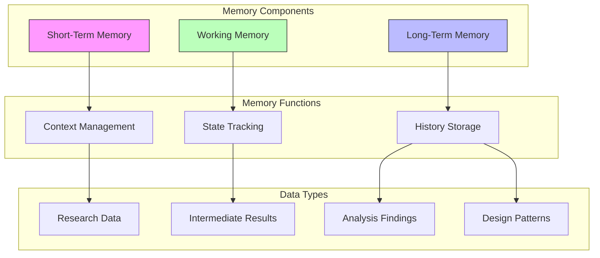
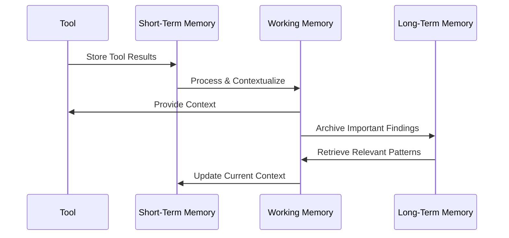
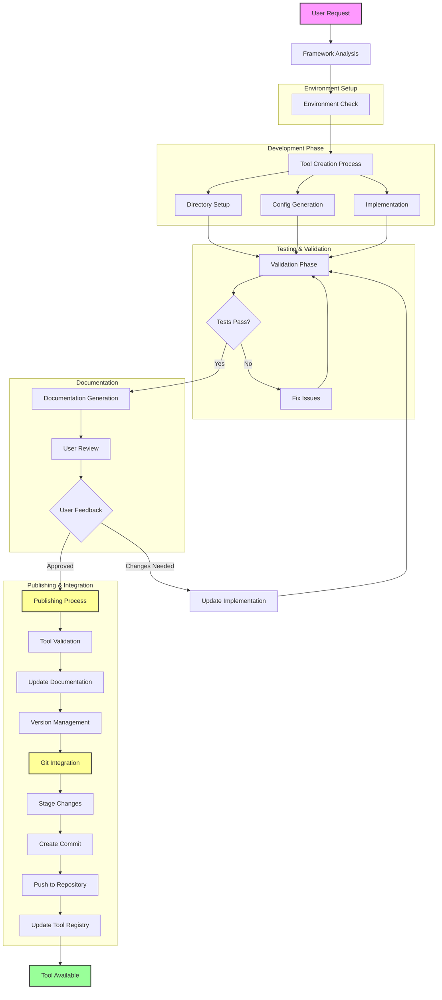
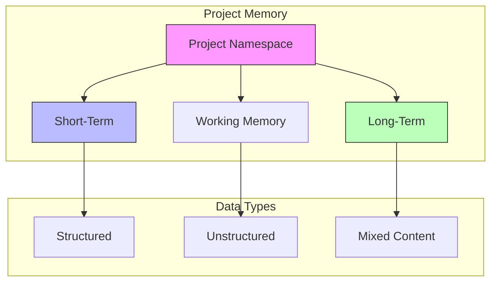
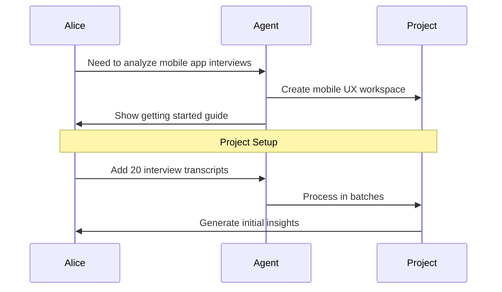
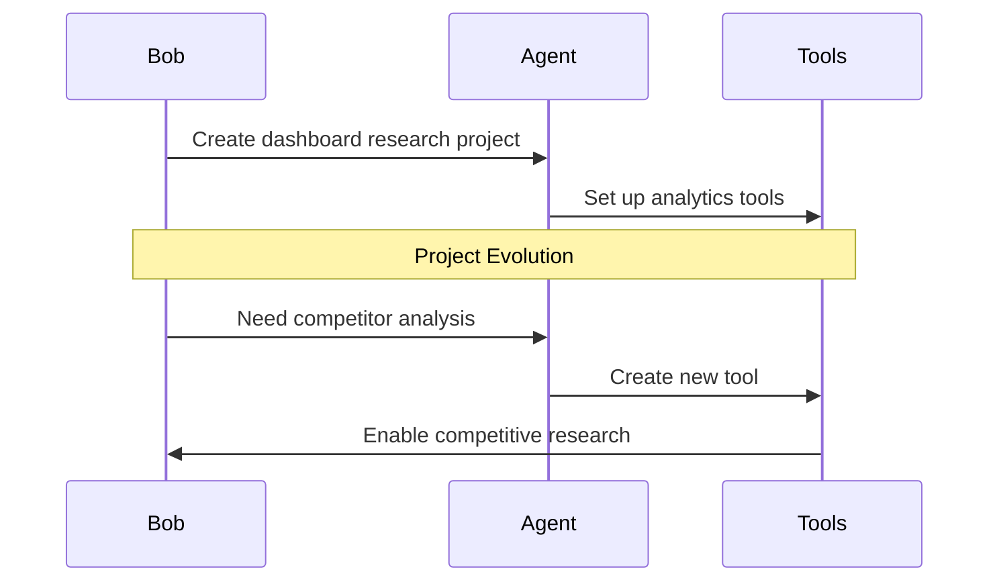

# ToolWeaver

An intelligent framework for weaving AI-powered tools within Cursor IDE, designed to seamlessly integrate with Cursor's Agent mode. This framework enables automatic tool creation, documentation, and management with a focus on modularity and maintainability. When running in Agent mode, Cursor can dynamically leverage ToolWeaver to create and utilize custom tools needed to complete complex tasks - from data processing to API integrations to code generation.

The framework empowers Cursor Agent to analyze tasks, identify required tooling capabilities, and automatically create, test and document the necessary tools. This creates a self-expanding ecosystem where new tools are generated on-demand based on the Agent's needs while maintaining high standards for documentation, testing and maintainability.

**Author:** Mehran Mozaffari

## 🎯 Use Cases

Here are some practical examples of how to use ToolWeaver:

### 1. Excel Data Processor
```python
@toolweaver.create
"""
I need a tool that can process Excel files containing sales data, calculate monthly 
totals, and generate summary statistics. The Excel files will always have columns 
for Date, Product, Quantity, and Price.
"""

# ToolWeaver will create:
# - Excel processor tool with pandas integration
# - Data validation for required columns
# - Statistical calculation methods
# - Summary report generation
# Location: tools/modules/excel_processor/

# After implementation and user feedback:
@toolweaver.publish("excel_processor")
"""
Implemented Excel processor with pandas integration for sales data analysis.
Features:
- Monthly totals calculation
- Summary statistics generation
- Data validation for required columns
- Automated report generation
"""
```

### 2. Weather API Client
```python
@toolweaver.create
@check_registry("api_fetcher")
"""
Create a tool to fetch weather data from OpenWeatherMap API for a given city and 
date range, with retry logic and rate limiting.
"""

# ToolWeaver will create:
# - API client with rate limiting
# - Retry mechanism with exponential backoff
# - Data caching
# - Error handling
# Location: tools/modules/weather_api_client/

# After implementation and user feedback:
@toolweaver.publish("weather_api_client")
"""
Implemented Weather API client with rate limiting and caching.
Features:
- OpenWeatherMap API integration
- Exponential backoff retry mechanism
- Response caching
- Comprehensive error handling
"""
```

### 3. React Component Generator
```python
@toolweaver.create
"""
I need a tool that generates React component boilerplate from a JSON specification. 
The spec should include component name, props, and state requirements.
"""

# ToolWeaver will create:
# - Component template generator
# - Props and state validator
# - TypeScript definitions generator
# - Component documentation generator
# Location: tools/modules/react_generator/
```

### 4. SQL Query Generator
```python
@toolweaver.create
"""
Create a tool that generates SQL queries based on plain English descriptions. 
It should handle SELECT, INSERT, UPDATE, and DELETE operations for a given 
schema.
"""

# ToolWeaver will create:
# - Natural language parser
# - SQL query builder
# - Schema validator
# - Query optimization suggestions
# Location: tools/modules/sql_generator/
```

### 5. Image Processing Pipeline
```python
@toolweaver.create
"""
Build a tool for batch processing images with operations like resize, format 
conversion, and watermarking. Support for multiple input/output formats and 
parallel processing.
"""

# ToolWeaver will create:
# - Image processing pipeline
# - Format conversion utilities
# - Parallel processing manager
# - Progress tracking
# Location: tools/modules/image_processor/
```

Each use case demonstrates how the framework automatically:
1. Creates appropriate directory structure
2. Generates necessary configuration files
3. Implements required dependencies
4. Sets up testing framework
5. Generates documentation
6. Integrates with existing tools

## 🚀 Quick Start

1. **Clone the Repository**
```bash
git clone https://github.com/imehr/toolweaver.git
cd toolweaver
```

2. **Set Up Environment**
```bash
# Python setup
python -m venv .venv
source .venv/bin/activate  # On Unix/macOS
# or
.venv\Scripts\activate     # On Windows

# Install dependencies
pip install -r requirements.txt

# Node.js setup (if needed)
npm install
```

## 🛠️ Framework Overview

This framework provides:
- Automated tool creation and management
- Integrated documentation system
- Built-in validation and testing
- Modular tool architecture
- Comprehensive documentation generation
- Advanced memory management and optimization

### Memory Management Features

The framework includes sophisticated memory management capabilities:

#### 🔄 Memory Optimization
- Multi-algorithm compression (LZ4, ZSTD, GZIP)
- Intelligent caching with LRU eviction
- Automatic compression for large datasets
- Memory usage optimization

#### 💾 Backup & Recovery
- Scheduled memory backups
- Tiered retention policy (daily/weekly/monthly)
- Encrypted backup storage
- Automated recovery procedures

#### 📊 Memory Analytics
- Real-time memory usage monitoring
- Performance metrics tracking
- Compression ratio analysis
- Operation latency measurements
- Automated alerting system

#### ✅ Validation & Integrity
- Continuous integrity checking
- Consistency validation
- Automatic error correction
- Multi-stage recovery procedures

### Memory System Architecture

The framework implements a sophisticated memory system that integrates with tools and manages different types of memory storage:



#### Memory Operations Flow



#### Memory Components

1. **Short-Term Memory**
   - Holds current context and immediate task information
   - Manages active tool interactions
   - Stores temporary results and intermediate data
   - Refreshes with each new task or context switch

2. **Working Memory**
   - Maintains current session state
   - Tracks ongoing operations and analysis
   - Manages tool transitions and handoffs
   - Holds active patterns and insights

3. **Long-Term Memory**
   - Stores completed operation results
   - Maintains patterns and best practices
   - Archives important findings
   - Preserves project history and decisions

## 🧪 Tool Recipes

Tool Recipes are user-defined workflows that specify how a tool should process information. They provide a structured way to define complex multi-step operations while maintaining integration with the memory system.

### Recipe Structure

```yaml
name: "tool_recipe_name"
description: "Detailed description of what the recipe does"
version: "1.0.0"

steps:
  - name: "step_name"
    type: "data_processing"
    description: "What this step does"
    memory_operations:
      read: ["input_data"]
      write: ["output_data"]
      context: ["processing_patterns"]
    operations:
      - "operation_1"
      - "operation_2"
    user_checkpoint: true  # Optional user interaction point
```

### Example: UX Research Interview Analysis

Here's a practical example of a Tool Recipe for analyzing user interviews:

```yaml
name: "ux_interview_analysis"
description: "Analyze and synthesize user interviews for UX research"
version: "1.0.0"

steps:
  - name: "transcript_analysis"
    type: "data_processing"
    description: "Analyze raw interview transcripts"
    memory_operations:
      read: ["raw_transcripts"]
      write: ["cleaned_transcripts"]
      context: ["cleaning_patterns"]
    operations:
      - "remove_filler_words"
      - "correct_grammar"

  - name: "insight_annotation"
    type: "analysis"
    description: "Annotate key insights"
    memory_operations:
      read: ["cleaned_transcripts"]
      write: ["annotated_insights"]
      context: ["annotation_patterns"]
    operations:
      - "highlight_key_quotes"
      - "tag_sentiments"
    user_checkpoint: true
```

### Memory Integration

Tool Recipes integrate with the memory system at three levels:

1. **Short-Term Memory**
   - Stores immediate step results
   - Maintains current processing context
   - Handles intermediate data

2. **Working Memory**
   - Manages workflow state
   - Tracks active patterns
   - Maintains processing context

3. **Long-Term Memory**
   - Stores completed analyses
   - Maintains proven workflows
   - Archives validated patterns

### Creating Tool Recipes

1. **Define the Recipe**
```python
@toolweaver.create_recipe
"""
I need a recipe for processing customer feedback that:
1. Analyzes sentiment
2. Extracts key themes
3. Generates summary reports
"""

# ToolWeaver will create:
# - Recipe template with defined steps
# - Memory integration points
# - User checkpoints
# Location: tools/modules/feedback_processor/recipes/
```

2. **Customize Operations**
```python
@toolweaver.customize_recipe("feedback_processor")
"""
Add data validation steps and error handling for:
- Input format validation
- Sentiment score normalization
- Theme clustering verification
"""
```

3. **Deploy and Use**
```python
@toolweaver.use_recipe("feedback_processor")
"""
Process customer feedback from Q2 2023:
- Input: feedback.csv
- Output: analysis_report.pdf
- Memory: use cached patterns
"""
```

### Benefits of Tool Recipes

1. **Structured Workflows**
   - Clear step definitions
   - Explicit memory interactions
   - Defined validation rules

2. **User Control**
   - Customizable checkpoints
   - Interactive refinement
   - Process visibility

3. **Memory Optimization**
   - Efficient data flow
   - Pattern reuse
   - Context preservation

4. **Maintainability**
   - Version control
   - Documentation generation
   - Testing integration

### Directory Structure
```
toolweaver/
├── tools/
│   ├── modules/           # Individual tool modules
│   └── README.md         # Tools documentation
├── .cursorrules          # Framework configuration
├── requirements.txt      # Python dependencies
└── package.json         # Node.js dependencies
```

## 📖 Tool Lifecycle Flow

Below is the complete lifecycle of a tool from creation to publication:



### Flow Phases

1. **Initial Request & Analysis**
   - User submits tool request
   - Framework analyzes requirements
   - Environment check and setup

2. **Development Phase**
   - Directory structure creation
   - Configuration generation
   - Tool implementation
   - Initial testing

3. **Testing & Validation**
   - Automated tests
   - Code validation
   - Issue resolution

4. **Documentation & Review**
   - Documentation generation
   - User review process
   - Feedback integration

5. **Publishing & Integration**
   - Final validation
   - Documentation updates
   - Version management
   - Git integration
   - Registry updates

## 📖 Creating New Tools

### 1. Tool Creation Process

```python
# Example tool structure in tools/modules/my_tool/
my_tool/
├── __init__.py
├── config.json
├── implementation.py
├── tests/
│   └── test_my_tool.py
└── README.md
```

### 2. Tool Configuration

```json
{
    "tool_name": "my_tool",
    "version": "1.0.0",
    "description": "Tool description",
    "inputs": {
        "parameter1": {"type": "string", "required": true},
        "parameter2": {"type": "integer", "default": 42}
    },
    "outputs": {
        "type": "object",
        "properties": {
            "result": {"type": "string"}
        }
    }
}
```

### 3. Implementation Example

```python
# tools/modules/my_tool/implementation.py

class MyTool:
    def __init__(self):
        self.config = self.load_config()

    def execute(self, parameter1: str, parameter2: int = 42):
        # Tool implementation
        result = f"Processed {parameter1} with {parameter2}"
        return {"result": result}
```

## 🔍 Using Tools

### Basic Usage

```python
from toolweaver.modules.my_tool import MyTool

# Initialize tool
tool = MyTool()

# Execute tool
result = tool.execute(parameter1="test", parameter2=100)
print(result)  # {"result": "Processed test with 100"}
```

## 🤖 Framework Features

### Automatic Documentation
- Tools are automatically documented in `README_AGENT_TOOLS.md`
- Each tool maintains its own documentation
- Examples and usage patterns are automatically extracted

### Validation System
- Input/output validation
- Test coverage requirements
- Documentation completeness checks
- Dependency management

### Environment Management
- Automatic virtual environment setup
- Dependency tracking and management
- Version control integration

## 📋 Best Practices

1. **Tool Development**
   - Keep tools modular and focused
   - Include comprehensive tests
   - Document all parameters and return values
   - Provide usage examples

2. **Documentation**
   - Keep README files up to date
   - Include practical examples
   - Document dependencies clearly
   - Maintain version history

3. **Testing**
   - Write unit tests for all functionality
   - Include edge cases
   - Test documentation examples
   - Validate all inputs and outputs

## 🤝 Contributing

1. Fork the repository
2. Create your feature branch (`git checkout -b feature/amazing-feature`)
3. Commit your changes (`git commit -m 'Add amazing feature'`)
4. Push to the branch (`git push origin feature/amazing-feature`)
5. Open a Pull Request

## 📄 License

This project is licensed under the MIT License - see the [LICENSE](LICENSE) file for details.

## 🙋‍♂️ Support

For support, please:
1. Check the documentation
2. Search existing issues
3. Create a new issue if needed

## 🌟 Acknowledgments

- Cursor IDE team
- Open source community 

## 📦 Publishing Tools

After creating and testing a tool, the framework offers an automated publishing workflow:

### Publishing Process

1. **Tool Validation**
```python
@validate_tool("tool_name")
# Framework automatically:
# - Runs all tests
# - Checks documentation
# - Validates configuration
# - Verifies dependencies
```

2. **User Feedback Integration**
```python
@update_tool("tool_name", feedback="User feedback here")
# Framework:
# - Updates documentation with usage notes
# - Adds user feedback to changelog
# - Updates version if needed
```

3. **Git Integration**
```python
@publish_tool("tool_name")
"""
Commit message describing the tool and changes
"""
# Framework automatically:
# 1. Stages changes:
#    - New tool files
#    - Updated documentation
#    - Modified dependencies
# 2. Creates commit with structured message
# 3. Pushes to specified branch
# 4. Updates tool registry
```

### Example Git Workflow

```bash
# Framework automatically runs:
git add tools/modules/new_tool/*
git add README_AGENT_TOOLS.md
git add requirements.txt  # if dependencies were added
git commit -m "feat(tools): Add new_tool for specific purpose

- Implemented core functionality
- Added comprehensive tests
- Updated documentation
- Integrated user feedback

Resolves: #issue_number"
git push origin main  # or specified branch
```

### Publishing Guidelines

1. **Before Publishing**
   - Ensure all tests pass
   - Documentation is complete
   - User feedback is incorporated
   - Dependencies are properly listed

2. **Commit Message Structure**
   - Type: feat, fix, docs, etc.
   - Scope: tools, config, docs
   - Description: Clear, concise purpose
   - Details: Bullet points of changes
   - References: Issues, feedback

3. **Version Management**
   - Semantic versioning
   - Automatic version bumps
   - Changelog updates
   - Release notes generation

## 🏗️ Project Management System

ToolWeaver introduces a sophisticated project management system that enables efficient organization of tools, recipes, and memory contexts across multiple projects.

### Project Workspace Structure

```
project_name/
├── data/              # Project data files
├── exports/           # Generated outputs
├── memory/           # Project-specific memory
├── config/           # Configuration files
├── tools/            # Project-specific tools
└── project.yaml      # Project configuration
```

### Project Configuration

```yaml
name: "project_name"
description: "Project description"
version: "1.0.0"

workspace:
  data_directory: "data/"
  memory_namespace: "${project_name}"
  export_directory: "exports/"

tools:
  - name: "tool_name"
    version: "1.2.0"
    config:
      # Tool-specific configuration

recipes:
  - name: "recipe_name"
    version: "1.0.0"
    batch_processing:
      enabled: true
      input_pattern: "*.data"
```

### Key Features

1. **Workspace Management**
   - Automatic project structure creation
   - Git integration for version control
   - Project-specific configuration
   - Tool and recipe management

2. **Tool Registry**
   - Centralized tool registration
   - Version management
   - Automatic dependency tracking
   - Documentation generation

3. **Recipe Management**
   - Workflow definition storage
   - Compatibility validation
   - Automatic registration
   - Cross-project sharing

## 🧠 Memory System

The memory system provides hierarchical storage and management of project data with sophisticated features for data organization and retrieval.

### Memory Architecture



### Memory Configuration

```yaml
memory:
  namespace: "${project_name}"
  retention_policy:
    short_term: "30d"
    working: "90d"
    long_term: "unlimited"
  
  data_types:
    structured:
      formats: ["json", "yaml"]
      validation: true
    unstructured:
      enabled: true
      types: ["text", "audio"]
```

### Features

1. **Namespace Management**
   - Project isolation
   - Hierarchical organization
   - Cross-project pattern sharing
   - Global pattern storage

2. **Data Type Support**
   - Structured data (JSON, YAML, TOML)
   - Unstructured data (text, audio, images)
   - Mixed content with metadata
   - Schema validation

3. **Memory Operations**
   - Automatic backups
   - Version control
   - Garbage collection
   - Data retention policies

## 🔄 Batch Processing

ToolWeaver supports efficient processing of multiple files with advanced monitoring and control features.

### Batch Configuration

```yaml
batch_processing:
  enabled: true
  parallel:
    max_workers: 5
    strategy: "process_pool"
  
  monitoring:
    progress_tracking: true
    status_updates: true
    error_handling:
      retry_count: 3
```

### Features

1. **Parallel Processing**
   - Multi-worker execution
   - Progress tracking
   - Error handling
   - Automatic retries

2. **Directory Watching**
   - Automatic file detection
   - Pattern matching
   - Recursive scanning
   - Ignore rules

3. **Export Management**
   - Multiple format support (PDF, JSON, HTML)
   - Template-based generation
   - Automatic archival
   - Compression support

## 🔧 Using Project Management

### 1. Creating a New Project

```python
@toolweaver.create_project
"""
Create a new UX research project:
name: ux_research_2024_q1
description: Q1 2024 User Research
tools_needed: [interview_analyzer, insight_synthesizer]
"""
```

### 2. Adding Tools to Project

```python
@toolweaver.add_tool
"""
Add sentiment analysis tool to project:
project: ux_research_2024_q1
tool: sentiment_analyzer
version: 1.2.0
"""
```

### 3. Configuring Batch Processing

```python
@toolweaver.configure_batch
"""
Configure batch processing for transcripts:
project: ux_research_2024_q1
input_pattern: *.transcript
parallel: true
max_workers: 5
"""
```

### 4. Managing Memory

```python
@toolweaver.memory_ops
"""
Configure memory for project:
project: ux_research_2024_q1
retention:
  short_term: 30d
  working: 90d
export_format: pdf
"""
```

## 📚 Managing Multiple Projects

ToolWeaver's project system allows you to manage multiple UX research projects simultaneously, each with its own isolated workspace, memory, and configurations. Here's how to work with multiple projects:

### Example: Managing Two UX Research Projects

Let's say you're working on two different projects:
1. Mobile App Redesign
2. Enterprise Dashboard Development

#### 1. Creating Project Workspaces

```python
# Project 1: Mobile App Redesign
@toolweaver.create_project
"""
Create UX research project:
name: mobile_app_redesign
description: Mobile app redesign research Q1 2024
base_directory: ~/projects/mobile_app/
tools_needed: [
    interview_analyzer,
    insight_synthesizer,
    journey_mapper
]
"""

# Project 2: Enterprise Dashboard
@toolweaver.create_project
"""
Create UX research project:
name: enterprise_dashboard
description: Enterprise dashboard UX research
base_directory: ~/projects/dashboard/
tools_needed: [
    interview_analyzer,
    insight_synthesizer,
    heuristic_evaluator
]
"""
```

This creates two isolated project workspaces:

```
~/projects/
├── mobile_app/
│   ├── data/
│   │   └── interviews/          # Mobile app interviews
│   ├── memory/
│   │   ├── short_term/
│   │   ├── working/
│   │   └── long_term/
│   ├── exports/
│   └── project.yaml
│
└── dashboard/
    ├── data/
    │   └── interviews/          # Dashboard interviews
    ├── memory/
    │   ├── short_term/
    │   ├── working/
    │   └── long_term/
    ├── exports/
    └── project.yaml
```

#### 2. Project-Specific Configurations

Each project can have its own configuration:

```yaml
# mobile_app/project.yaml
name: "mobile_app_redesign"
version: "1.0.0"

workspace:
  data_directory: "data/"
  interview_directory: "data/interviews/"
  memory_namespace: "mobile_app"

tools:
  - name: "interview_analyzer"
    version: "1.2.0"
    config:
      focus_areas: ["mobile_usability", "gesture_interactions"]
      user_segments: ["mobile_native", "cross_platform"]

recipes:
  - name: "ux_interview_analysis"
    version: "1.0.0"
    batch_processing:
      enabled: true
      input_pattern: "*.transcript"
      watch_directory: true

memory:
  retention_policy:
    short_term: "30d"
    working: "90d"
```

```yaml
# dashboard/project.yaml
name: "enterprise_dashboard"
version: "1.0.0"

workspace:
  data_directory: "data/"
  interview_directory: "data/interviews/"
  memory_namespace: "dashboard"

tools:
  - name: "interview_analyzer"
    version: "1.2.0"
    config:
      focus_areas: ["data_visualization", "enterprise_workflow"]
      user_segments: ["data_analysts", "managers"]

recipes:
  - name: "ux_interview_analysis"
    version: "1.0.0"
    batch_processing:
      enabled: true
      input_pattern: "*.transcript"
```

#### 3. Using the UX Research Tool in Different Projects

```python
# Switch to Mobile App project and run analysis
@toolweaver.use_project("mobile_app_redesign")
"""
Run UX research analysis:
input_directory: data/interviews/
recipe: ux_interview_analysis
focus: mobile_usability
"""

# Switch to Dashboard project and run analysis
@toolweaver.use_project("enterprise_dashboard")
"""
Run UX research analysis:
input_directory: data/interviews/
recipe: ux_interview_analysis
focus: data_visualization
"""
```

#### 4. Project-Specific Memory Operations

```python
# Access Mobile App project insights
@toolweaver.memory_ops
"""
Project: mobile_app_redesign
Operation: retrieve_insights
Memory_type: long_term
Pattern: user_journey
"""

# Access Dashboard project insights
@toolweaver.memory_ops
"""
Project: enterprise_dashboard
Operation: retrieve_insights
Memory_type: long_term
Pattern: workflow_optimization
"""
```

#### 5. Cross-Project Pattern Sharing

```python
@toolweaver.share_patterns
"""
Source_project: mobile_app_redesign
Target_project: enterprise_dashboard
Pattern_types: [
    "user_interaction_patterns",
    "navigation_patterns"
]
Adaptation_rules: {
    "mobile_gestures": "desktop_interactions",
    "screen_size": "responsive_layout"
}
"""
```

### Project Isolation and Sharing

1. **Isolated Resources**
   - Each project has its own memory namespace
   - Separate data directories
   - Project-specific tool configurations
   - Independent batch processing

2. **Shared Resources**
   - Global tool registry
   - Common recipe templates
   - Shared pattern library
   - Cross-project insights

3. **Project Switching**
   ```python
   @toolweaver.switch_project
   """
   Project: mobile_app_redesign
   Load_context: true
   Preserve_global_patterns: true
   """
   ```

4. **Project Status Monitoring**
   ```python
   @toolweaver.project_status
   """
   Project: mobile_app_redesign
   Show:
     - active_processes
     - memory_usage
     - recent_insights
     - pending_tasks
   """
   ```

### Best Practices for Multi-Project Management

1. **Project Organization**
   - Use clear, descriptive project names
   - Maintain consistent directory structure
   - Document project-specific configurations
   - Regular memory cleanup

2. **Resource Management**
   - Monitor memory usage per project
   - Archive completed projects
   - Share relevant patterns
   - Maintain tool version compatibility

3. **Workflow Management**
   - Create project-specific recipes
   - Configure appropriate batch sizes
   - Set up project-specific monitoring
   - Define clear export formats

## 🗣️ Natural Language Interaction: A User's Guide

ToolWeaver is designed to be accessible to everyone, regardless of technical background. Here's how different team members can interact with it naturally:

### For UX Researchers

```
You: "I need to analyze user interviews for our new product"
Agent: "I'll set up a UX research project for you. Would you like me to:
       - Create a workspace for your interviews
       - Set up analysis tools
       - Configure automatic pattern recognition?"

You: "Yes, and I have 20 interview transcripts to analyze"
Agent: "I'll set up batch processing. Just put your transcripts in the 
       data/interviews folder, and I'll analyze them automatically."
```

### For Designers

```
You: "Show me patterns from last week's user interviews"
Agent: "I found several UX patterns:
       - Navigation preferences
       - Common pain points
       - Feature requests
       Would you like me to create a visual summary?"

You: "Export this as a presentation for stakeholders"
Agent: "Creating a presentation with:
       - Key insights highlighted
       - User journey maps
       - Actionable recommendations"
```

### For Product Managers

```
You: "What are the top user pain points from Q1 research?"
Agent: "Analyzing all Q1 interviews...
       Found these key issues:
       1. Onboarding complexity
       2. Feature discovery
       3. Performance concerns
       Would you like a detailed report?"
```

## 📚 Real-World Example: A Tale of Two Projects

Let's see how two different team members use ToolWeaver for their projects:

### Alice's Mobile App Project



1. **Starting the Project**
   ```
   Alice: "I need to analyze user interviews for our mobile app"
   Agent: "Creating 'mobile_app_research' project with:
          - Mobile UX analysis tools
          - Gesture pattern recognition
          - User journey mapping"
   ```

2. **Adding Data**
   ```
   Alice: "I have interview transcripts to analyze"
   Agent: "I'll process them in batches and look for:
          - Mobile interaction patterns
          - Gesture preferences
          - Navigation flows"
   ```

### Bob's Dashboard Project



1. **Initial Setup**
   ```
   Bob: "Create a project for enterprise dashboard research"
   Agent: "Setting up 'dashboard_research' with:
          - Interview analysis tools
          - Data visualization analysis
          - Workflow pattern recognition"
   ```

2. **Adding New Capabilities**
   ```
   Bob: "I need to analyze competitor dashboards"
   Agent: "Creating a competitor analysis tool that can:
          - Compare feature sets
          - Analyze layouts
          - Track UX patterns"
   ```

### Cross-Project Learning

The system enables knowledge sharing between projects:

```
Alice: "What tools are available in other projects?"
Agent: "The dashboard project has a competitor analysis tool.
       I can adapt it for mobile app comparison:
       - Modify for mobile interfaces
       - Add gesture analysis
       - Focus on mobile patterns"
```

## 💡 Getting Started for Non-Technical Users

1. **Start Your Project**
   ```
   Just tell the agent what you need:
   "I need to analyze user research for our new product"
   ```

2. **Add Your Data**
   ```
   Put your files in the right folder and say:
   "Analyze the new interviews I added"
   ```

3. **Get Insights**
   ```
   Ask questions naturally:
   "What patterns did you find?"
   "Show me the key user pain points"
   "Create a presentation for stakeholders"
   ```

4. **Share and Collaborate**
   ```
   Easy project sharing:
   "Share these insights with the design team"
   "Export this as a PDF report"
   "Show what other teams have discovered"
   ```

## 🔄 Coming Back to Your Work

The system remembers your context:

```
You: "Continue working on the mobile app research"
Agent: "Welcome back to mobile app research!
       Since your last session:
       - 5 new interviews analyzed
       - 3 new patterns identified
       - 2 reports generated"
```

## 🎯 Project Evolution

Your project can grow with your needs:

1. **Start Simple**
   ```
   "I need to analyze some user interviews"
   ```

2. **Add Capabilities**
   ```
   "I also need to analyze competitor products"
   ```

3. **Share Knowledge**
   ```
   "What insights can we use from other projects?"
   ```