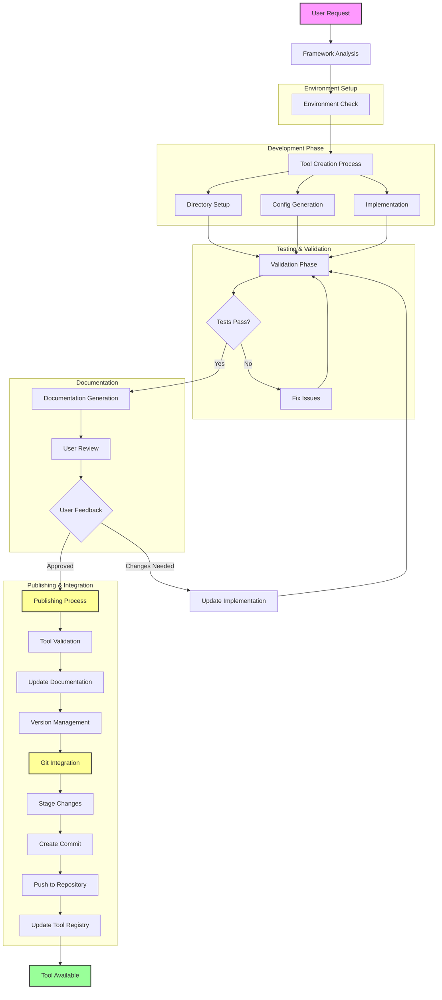

# ToolWeaver

An intelligent framework for weaving AI-powered tools within Cursor IDE. This framework enables automatic tool creation, documentation, and management with a focus on modularity and maintainability.

**Author:** Mehran Mozaffari

## 🎯 Use Cases

Here are some practical examples of how to use ToolWeaver:

### 1. Excel Data Processor
```python
@toolweaver.create
"""
I need a tool that can process Excel files containing sales data, calculate monthly 
totals, and generate summary statistics. The Excel files will always have columns 
for Date, Product, Quantity, and Price.
"""

# ToolWeaver will create:
# - Excel processor tool with pandas integration
# - Data validation for required columns
# - Statistical calculation methods
# - Summary report generation
# Location: tools/modules/excel_processor/

# After implementation and user feedback:
@toolweaver.publish("excel_processor")
"""
Implemented Excel processor with pandas integration for sales data analysis.
Features:
- Monthly totals calculation
- Summary statistics generation
- Data validation for required columns
- Automated report generation
"""
```

### 2. Weather API Client
```python
@toolweaver.create
@check_registry("api_fetcher")
"""
Create a tool to fetch weather data from OpenWeatherMap API for a given city and 
date range, with retry logic and rate limiting.
"""

# ToolWeaver will create:
# - API client with rate limiting
# - Retry mechanism with exponential backoff
# - Data caching
# - Error handling
# Location: tools/modules/weather_api_client/

# After implementation and user feedback:
@toolweaver.publish("weather_api_client")
"""
Implemented Weather API client with rate limiting and caching.
Features:
- OpenWeatherMap API integration
- Exponential backoff retry mechanism
- Response caching
- Comprehensive error handling
"""
```

### 3. React Component Generator
```python
@toolweaver.create
"""
I need a tool that generates React component boilerplate from a JSON specification. 
The spec should include component name, props, and state requirements.
"""

# ToolWeaver will create:
# - Component template generator
# - Props and state validator
# - TypeScript definitions generator
# - Component documentation generator
# Location: tools/modules/react_generator/
```

### 4. SQL Query Generator
```python
@toolweaver.create
"""
Create a tool that generates SQL queries based on plain English descriptions. 
It should handle SELECT, INSERT, UPDATE, and DELETE operations for a given 
schema.
"""

# ToolWeaver will create:
# - Natural language parser
# - SQL query builder
# - Schema validator
# - Query optimization suggestions
# Location: tools/modules/sql_generator/
```

### 5. Image Processing Pipeline
```python
@toolweaver.create
"""
Build a tool for batch processing images with operations like resize, format 
conversion, and watermarking. Support for multiple input/output formats and 
parallel processing.
"""

# ToolWeaver will create:
# - Image processing pipeline
# - Format conversion utilities
# - Parallel processing manager
# - Progress tracking
# Location: tools/modules/image_processor/
```

Each use case demonstrates how the framework automatically:
1. Creates appropriate directory structure
2. Generates necessary configuration files
3. Implements required dependencies
4. Sets up testing framework
5. Generates documentation
6. Integrates with existing tools

## 🚀 Quick Start

1. **Clone the Repository**
```bash
git clone https://github.com/imehr/toolweaver.git
cd toolweaver
```

2. **Set Up Environment**
```bash
# Python setup
python -m venv .venv
source .venv/bin/activate  # On Unix/macOS
# or
.venv\Scripts\activate     # On Windows

# Install dependencies
pip install -r requirements.txt

# Node.js setup (if needed)
npm install
```

## 🛠️ Framework Overview

This framework provides:
- Automated tool creation and management
- Integrated documentation system
- Built-in validation and testing
- Modular tool architecture
- Comprehensive documentation generation

### Directory Structure
```
toolweaver/
├── tools/
│   ├── modules/           # Individual tool modules
│   └── README.md         # Tools documentation
├── .cursorrules          # Framework configuration
├── requirements.txt      # Python dependencies
└── package.json         # Node.js dependencies
```

## 📖 Tool Lifecycle Flow

Below is the complete lifecycle of a tool from creation to publication:



### Flow Phases

1. **Initial Request & Analysis**
   - User submits tool request
   - Framework analyzes requirements
   - Environment check and setup

2. **Development Phase**
   - Directory structure creation
   - Configuration generation
   - Tool implementation
   - Initial testing

3. **Testing & Validation**
   - Automated tests
   - Code validation
   - Issue resolution

4. **Documentation & Review**
   - Documentation generation
   - User review process
   - Feedback integration

5. **Publishing & Integration**
   - Final validation
   - Documentation updates
   - Version management
   - Git integration
   - Registry updates

## 📖 Creating New Tools

### 1. Tool Creation Process

```python
# Example tool structure in tools/modules/my_tool/
my_tool/
├── __init__.py
├── config.json
├── implementation.py
├── tests/
│   └── test_my_tool.py
└── README.md
```

### 2. Tool Configuration

```json
{
    "tool_name": "my_tool",
    "version": "1.0.0",
    "description": "Tool description",
    "inputs": {
        "parameter1": {"type": "string", "required": true},
        "parameter2": {"type": "integer", "default": 42}
    },
    "outputs": {
        "type": "object",
        "properties": {
            "result": {"type": "string"}
        }
    }
}
```

### 3. Implementation Example

```python
# tools/modules/my_tool/implementation.py

class MyTool:
    def __init__(self):
        self.config = self.load_config()

    def execute(self, parameter1: str, parameter2: int = 42):
        # Tool implementation
        result = f"Processed {parameter1} with {parameter2}"
        return {"result": result}
```

## 🔍 Using Tools

### Basic Usage

```python
from toolweaver.modules.my_tool import MyTool

# Initialize tool
tool = MyTool()

# Execute tool
result = tool.execute(parameter1="test", parameter2=100)
print(result)  # {"result": "Processed test with 100"}
```

## 🤖 Framework Features

### Automatic Documentation
- Tools are automatically documented in `README_AGENT_TOOLS.md`
- Each tool maintains its own documentation
- Examples and usage patterns are automatically extracted

### Validation System
- Input/output validation
- Test coverage requirements
- Documentation completeness checks
- Dependency management

### Environment Management
- Automatic virtual environment setup
- Dependency tracking and management
- Version control integration

## 📋 Best Practices

1. **Tool Development**
   - Keep tools modular and focused
   - Include comprehensive tests
   - Document all parameters and return values
   - Provide usage examples

2. **Documentation**
   - Keep README files up to date
   - Include practical examples
   - Document dependencies clearly
   - Maintain version history

3. **Testing**
   - Write unit tests for all functionality
   - Include edge cases
   - Test documentation examples
   - Validate all inputs and outputs

## 🤝 Contributing

1. Fork the repository
2. Create your feature branch (`git checkout -b feature/amazing-feature`)
3. Commit your changes (`git commit -m 'Add amazing feature'`)
4. Push to the branch (`git push origin feature/amazing-feature`)
5. Open a Pull Request

## 📄 License

This project is licensed under the MIT License - see the [LICENSE](LICENSE) file for details.

## 🙋‍♂️ Support

For support, please:
1. Check the documentation
2. Search existing issues
3. Create a new issue if needed

## 🌟 Acknowledgments

- Cursor IDE team
- Open source community 

## 📦 Publishing Tools

After creating and testing a tool, the framework offers an automated publishing workflow:

### Publishing Process

1. **Tool Validation**
```python
@validate_tool("tool_name")
# Framework automatically:
# - Runs all tests
# - Checks documentation
# - Validates configuration
# - Verifies dependencies
```

2. **User Feedback Integration**
```python
@update_tool("tool_name", feedback="User feedback here")
# Framework:
# - Updates documentation with usage notes
# - Adds user feedback to changelog
# - Updates version if needed
```

3. **Git Integration**
```python
@publish_tool("tool_name")
"""
Commit message describing the tool and changes
"""
# Framework automatically:
# 1. Stages changes:
#    - New tool files
#    - Updated documentation
#    - Modified dependencies
# 2. Creates commit with structured message
# 3. Pushes to specified branch
# 4. Updates tool registry
```

### Example Git Workflow

```bash
# Framework automatically runs:
git add tools/modules/new_tool/*
git add README_AGENT_TOOLS.md
git add requirements.txt  # if dependencies were added
git commit -m "feat(tools): Add new_tool for specific purpose

- Implemented core functionality
- Added comprehensive tests
- Updated documentation
- Integrated user feedback

Resolves: #issue_number"
git push origin main  # or specified branch
```

### Publishing Guidelines

1. **Before Publishing**
   - Ensure all tests pass
   - Documentation is complete
   - User feedback is incorporated
   - Dependencies are properly listed

2. **Commit Message Structure**
   - Type: feat, fix, docs, etc.
   - Scope: tools, config, docs
   - Description: Clear, concise purpose
   - Details: Bullet points of changes
   - References: Issues, feedback

3. **Version Management**
   - Semantic versioning
   - Automatic version bumps
   - Changelog updates
   - Release notes generation