# ToolWeaver: Building an Intelligent Tool Ecosystem for UX Research Agent

## Introduction

User Experience (UX) research requires handling complex, multi-step processes from raw data collection to final design outputs. ToolWeaver provides a framework for building specialized tools that can be orchestrated by a single AI agent (similar to small language model agents) to conduct comprehensive UX research and design processes. By leveraging Cursor's agent capabilities, ToolWeaver enables the creation and orchestration of purpose-built tools for each step of the UX research workflow.

## Agent-Tool Architecture

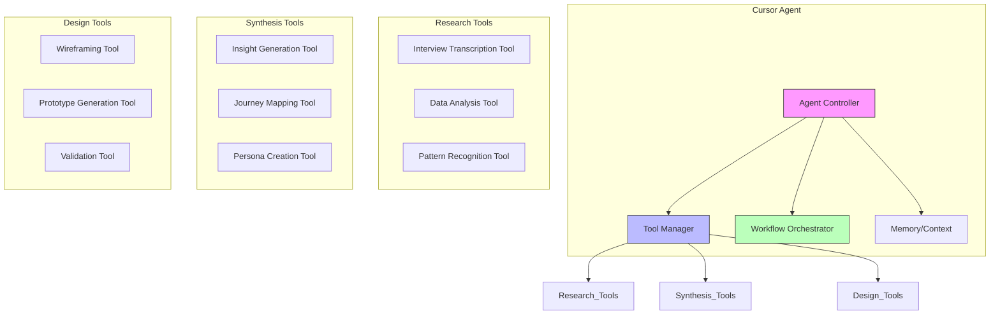

## UX Research Workflow

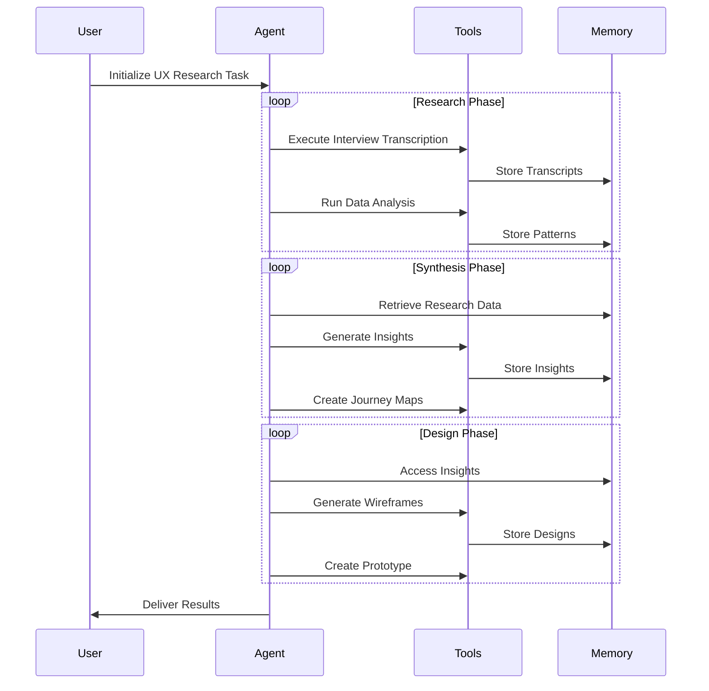

## Tool Ecosystem

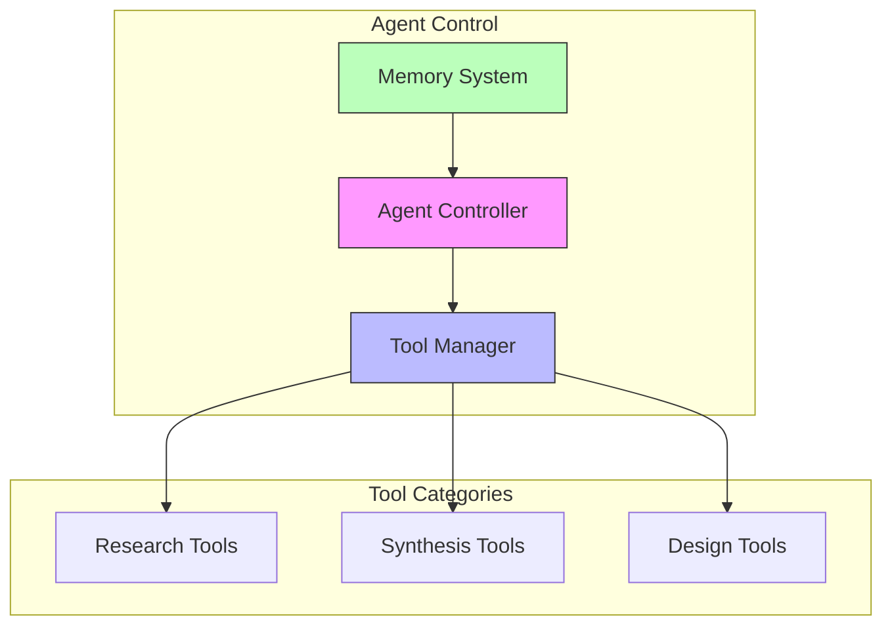

## Tool Recipes: User-Defined Workflows

One of ToolWeaver's most powerful features is its Tool Recipe system, which allows users to define precise, multi-step workflows for complex tasks. Tool Recipes provide a structured way to specify how tools should process information while maintaining tight integration with the memory system.

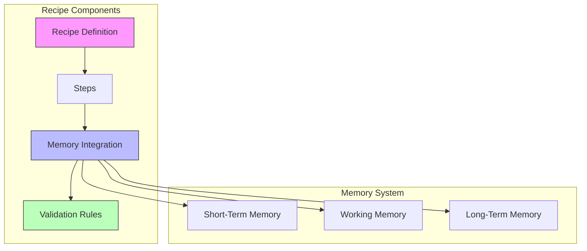

### Recipe Structure Example

Here's how a Tool Recipe is defined for a UX research workflow:

```yaml
name: "ux_interview_analysis"
description: "Analyze and synthesize user interviews for UX research"
version: "1.0.0"

steps:
  - name: "transcript_analysis"
    type: "data_processing"
    description: "Analyze raw interview transcripts"
    memory_operations:
      read: ["raw_transcripts"]
      write: ["cleaned_transcripts"]
      context: ["cleaning_patterns"]
    operations:
      - "remove_filler_words"
      - "correct_grammar"

  - name: "insight_annotation"
    type: "analysis"
    description: "Annotate key insights"
    memory_operations:
      read: ["cleaned_transcripts"]
      write: ["annotated_insights"]
      context: ["annotation_patterns"]
    operations:
      - "highlight_key_quotes"
      - "tag_sentiments"
    user_checkpoint: true
```

### Memory Integration in Recipes

Tool Recipes interact with the memory system at three distinct levels:

1. **Short-Term Memory**
   - Stores immediate step results
   - Maintains current processing context
   - Handles intermediate data between steps

2. **Working Memory**
   - Manages active workflow state
   - Tracks patterns during execution
   - Maintains processing context across steps

3. **Long-Term Memory**
   - Archives completed analyses
   - Stores proven workflow patterns
   - Maintains reusable insights

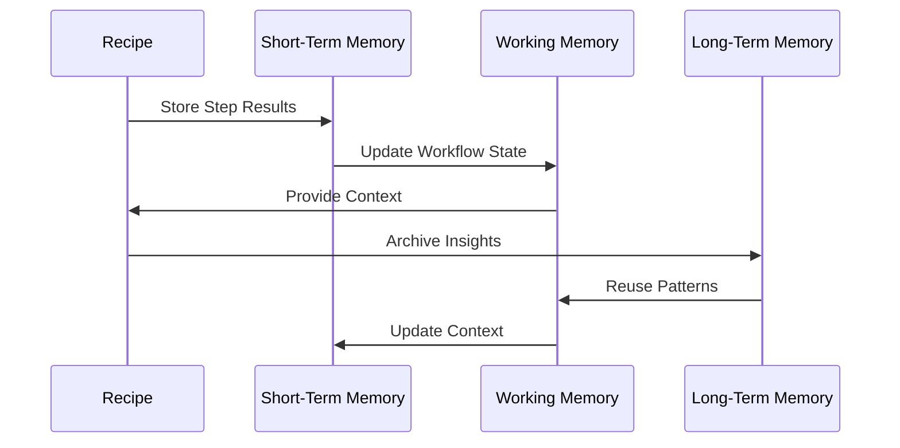

## Project Workspaces and Memory Management

ToolWeaver introduces the concept of Project Workspaces to organize tools, recipes, and memory contexts for different projects. This allows for efficient management of multiple UX research projects while maintaining isolated memory spaces and project-specific configurations.

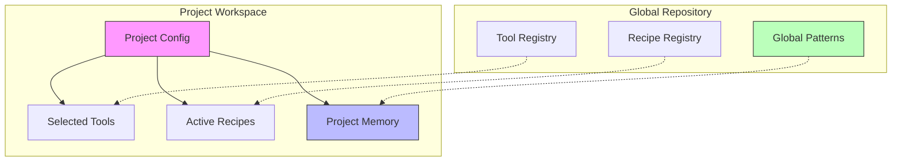

### Project Configuration Example

```yaml
name: "ux_research_2024_q1"
description: "Q1 2024 User Research for Product X"
version: "1.0.0"

workspace:
  data_directory: "./research_data/2024_q1/"
  memory_namespace: "project_x_2024_q1"
  export_directory: "./exports/2024_q1/"

tools:
  - name: "interview_analyzer"
    version: "1.2.0"
    config:
      batch_size: 5
      parallel_processing: true
  - name: "insight_synthesizer"
    version: "1.0.1"
  - name: "report_generator"
    version: "2.1.0"

recipes:
  - name: "ux_interview_analysis"
    version: "1.0.0"
    batch_processing:
      enabled: true
      input_pattern: "*.transcript"
      watch_directory: true
      auto_process_new: true

memory:
  namespace: "project_x_2024_q1"
  retention_policy:
    short_term: "30d"
    working: "90d"
    long_term: "unlimited"
  export_formats:
    - format: "pdf"
      template: "executive_summary"
    - format: "json"
      template: "raw_insights"
  unstructured_data:
    enabled: true
    storage_path: "./memory/unstructured/"
```

### Batch Processing with Memory Context

Here's how the enhanced interview analysis recipe handles batch processing while maintaining project context:

```yaml
name: "ux_interview_analysis"
description: "Batch process multiple interview transcripts"
version: "1.0.0"

batch_config:
  input_directory: "${workspace.data_directory}/transcripts/"
  pattern: "*.transcript"
  parallel_processing: true
  max_concurrent: 5

steps:
  - name: "batch_initialization"
    type: "setup"
    description: "Initialize batch processing context"
    memory_operations:
      write: ["batch_context"]
      context: ["project_patterns"]
    operations:
      - "scan_input_directory"
      - "create_batch_registry"
      - "initialize_project_memory"

  - name: "transcript_analysis"
    type: "data_processing"
    description: "Process each transcript"
    batch_mode: true
    memory_operations:
      read: ["batch_context", "project_patterns"]
      write: ["processed_transcripts"]
      context: ["analysis_patterns"]
    operations:
      - "remove_filler_words"
      - "correct_grammar"
      - "update_batch_progress"

  - name: "cross_transcript_analysis"
    type: "analysis"
    description: "Analyze patterns across all transcripts"
    memory_operations:
      read: ["processed_transcripts", "project_patterns"]
      write: ["cross_transcript_insights"]
      context: ["project_insights"]
    operations:
      - "identify_common_themes"
      - "cross_reference_insights"
      - "update_project_patterns"

  - name: "memory_consolidation"
    type: "synthesis"
    description: "Consolidate insights into project memory"
    memory_operations:
      read: ["cross_transcript_insights", "project_insights"]
      write: ["project_memory"]
      context: ["project_patterns"]
    operations:
      - "merge_insights"
      - "update_project_context"
      - "archive_batch_results"
    user_checkpoint: true

export_configs:
  - name: "executive_summary"
    format: "pdf"
    template: "executive_template"
    sections: ["key_findings", "themes", "recommendations"]
  
  - name: "raw_insights"
    format: "json"
    structure: "hierarchical"
    include: ["insights", "patterns", "metadata"]
```

### Memory Namespace Management

The memory system organizes data in hierarchical namespaces:

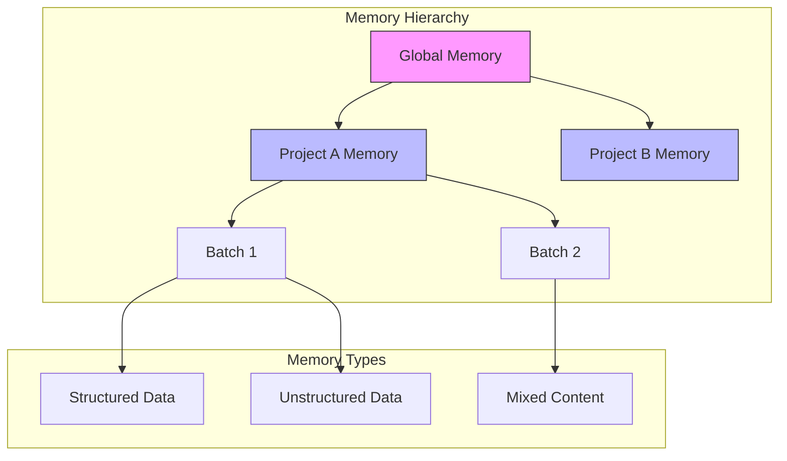

1. **Project Isolation**
   - Each project has its own memory namespace
   - Cross-project patterns stored in global memory
   - Configurable retention policies per namespace

2. **Memory Types**
   - Structured data (JSON, YAML)
   - Unstructured data (text, audio, images)
   - Mixed content with metadata

3. **Memory Operations**
   - Automatic namespace management
   - Cross-project pattern recognition
   - Configurable export formats
   - Batch processing state management

### Project Workspace Management

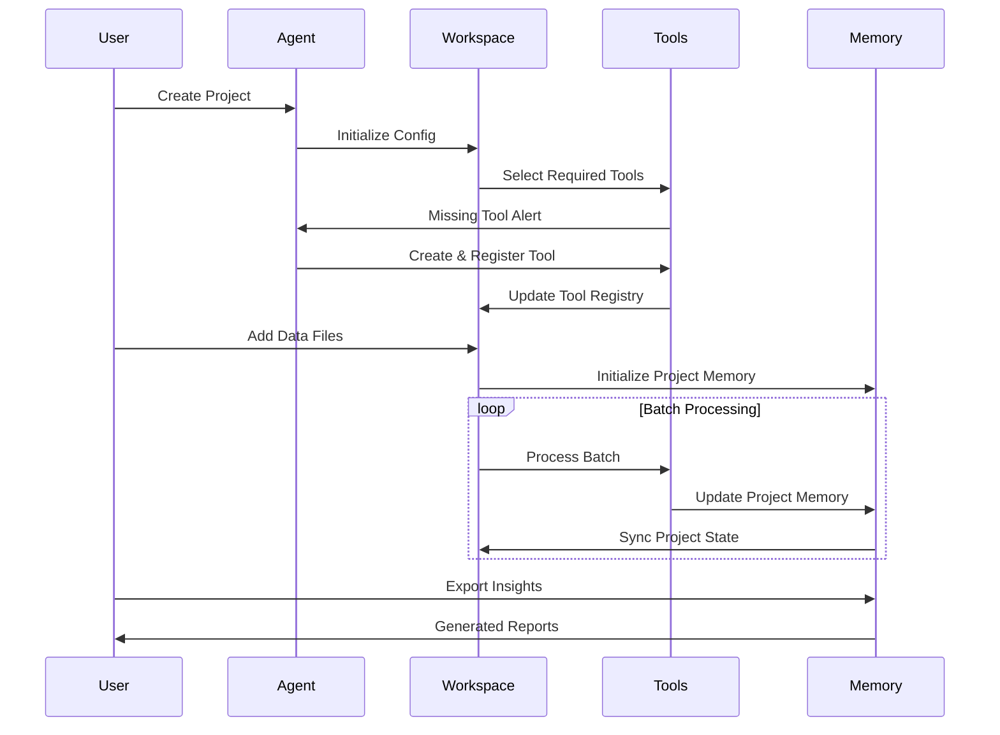

## How It Works

1. **Single Agent, Multiple Tools, Customizable Recipes**
   - One Cursor agent orchestrates the entire process
   - Each tool is specialized for a specific task
   - Tool Recipes define precise workflows
   - Agent maintains context and manages execution

2. **Tool and Recipe Selection**
   - Agent analyzes task requirements
   - Selects appropriate tools and recipes
   - Executes workflow with proper parameters
   - Processes and stores results in memory

3. **Workflow Management**
   - Recipe defines step sequence and checkpoints
   - Agent maintains research context
   - Memory system ensures data consistency
   - User can intervene at defined checkpoints

## Example Workflow

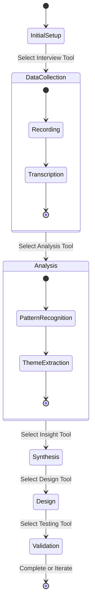

## Benefits of ToolWeaver's Approach

1. **Specialized Tool Creation and Recipe Definition**
   - Purpose-built tools for specific UX tasks
   - User-defined workflow recipes
   - Built-in validation and testing
   - Automatic documentation generation

2. **Intelligent Tool Orchestration**
   - Context-aware tool and recipe selection
   - Efficient workflow management
   - Automated task routing
   - Error handling and recovery

3. **Unified Agent Control**
   - Centralized workflow management
   - Recipe-driven process execution
   - Efficient resource utilization
   - Seamless tool integration

## Future of UX Research with ToolWeaver

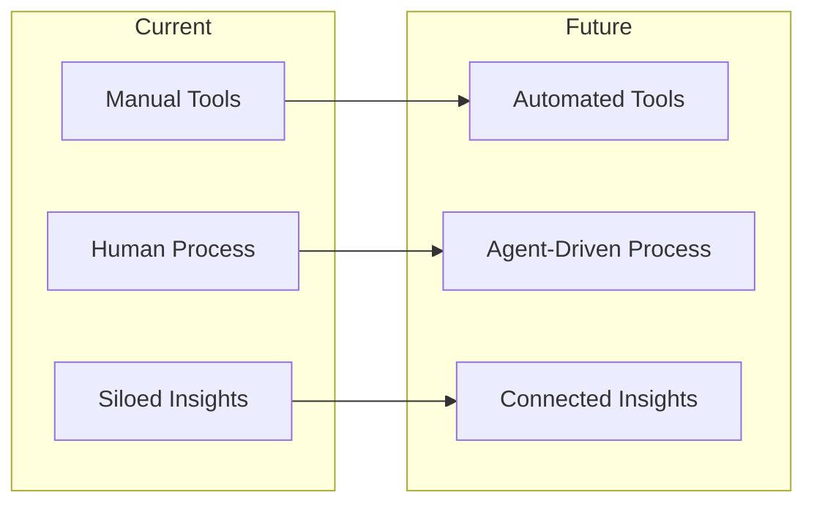

## Conclusion

ToolWeaver transforms UX research by providing a structured framework for building and orchestrating specialized tools through a single intelligent agent. By breaking down complex UX processes into manageable components and enabling efficient tool orchestration, it creates a more streamlined and effective approach to UX research and design.

The framework's capabilities allow organizations to:
- Create specialized tools for specific UX tasks
- Maintain consistent research methodologies
- Scale UX research operations efficiently
- Generate deeper, connected insights
- Accelerate the design process through automation

As AI continues to evolve, ToolWeaver's approach to tool building and agent-based orchestration will become increasingly valuable in creating more sophisticated and effective UX research and design workflows.

Would you like me to expand on any particular aspect of this conceptual overview?

## Memory System Architecture

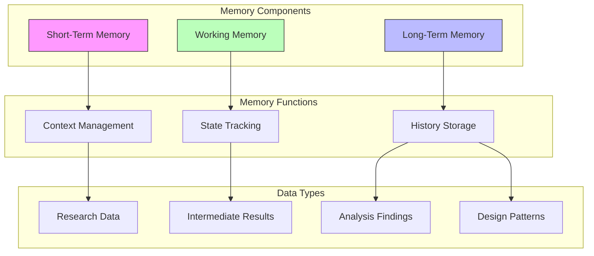

### Memory System Components

1. **Short-Term Memory**
   - Holds current context and immediate task information
   - Manages active tool interactions
   - Stores temporary results and intermediate data
   - Refreshes with each new task or context switch

2. **Working Memory**
   - Maintains current research session state
   - Tracks ongoing analysis and synthesis
   - Manages tool transitions and handoffs
   - Holds active patterns and insights

3. **Long-Term Memory**
   - Stores completed research findings
   - Maintains design patterns and best practices
   - Archives user insights and personas
   - Preserves project history and decisions

### Memory Operations

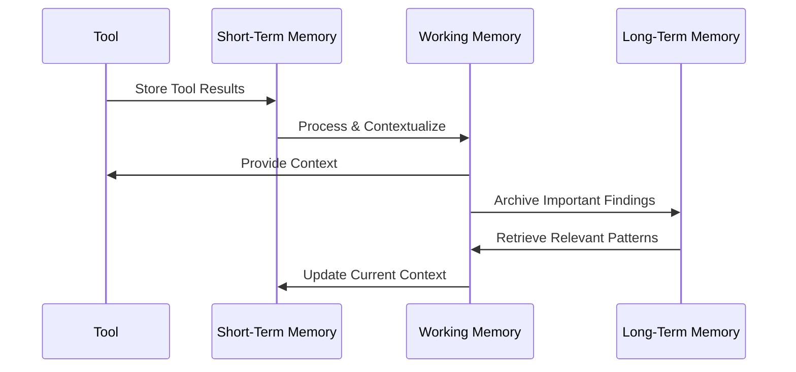

### Memory Usage in UX Research Flow

1. **Research Phase**
   - STM: Holds interview transcripts and immediate observations
   - WM: Maintains current research themes and patterns
   - LTM: Stores historical research data and insights

2. **Synthesis Phase**
   - STM: Processes current analysis results
   - WM: Builds connections between findings
   - LTM: Provides relevant past insights and patterns

3. **Design Phase**
   - STM: Manages active design decisions
   - WM: Maintains design context and requirements
   - LTM: Supplies proven design patterns and solutions

## Real-World Scenario: Enterprise Design System Research

### Initial Scenario
A company needs to research, analyze, and create a new enterprise design system based on existing applications, user feedback, and industry standards.

### Tool Building Phase

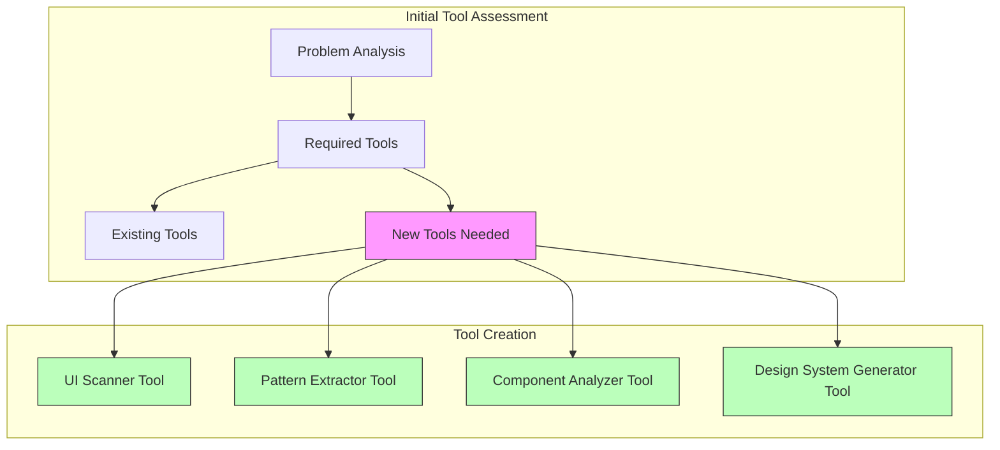

### Dynamic Workflow Orchestration

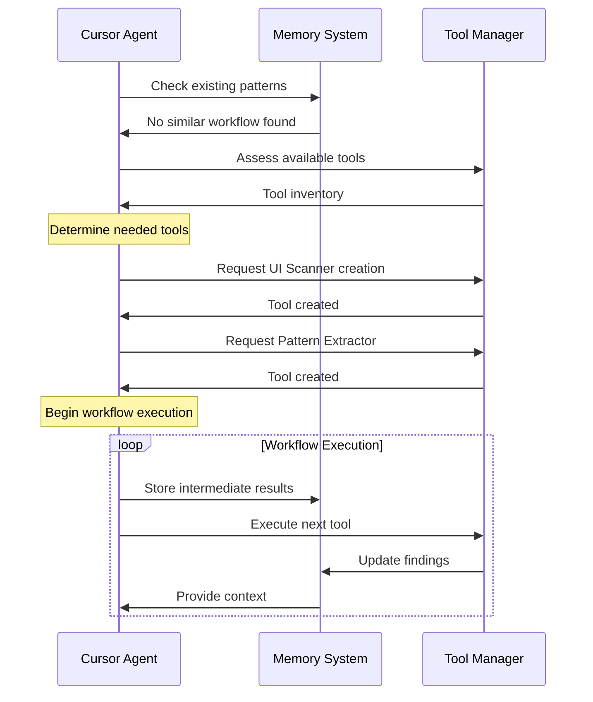

### Adaptive Tool Building Process

1. **Initial Assessment**
   - Scan existing applications
   - Analyze user feedback
   - Review industry standards
   - Identify tool gaps

2. **Tool Creation Sequence**
   ```
   Required Tools:
   - UI Scanner Tool (scan existing interfaces)
   - Pattern Extractor Tool (identify common patterns)
   - Component Analyzer Tool (analyze component usage)
   - Design System Generator Tool (create system documentation)
   - Validation Tool (test system compliance)
   ```

3. **Memory Integration**
   ```mermaid
   graph LR
       subgraph "Memory Utilization"
           STM[Short-Term Memory]
           WM[Working Memory]
           LTM[Long-Term Memory]
       end
       
       subgraph "Tool Interaction"
           T[Tools]
           W[Workflow]
           D[Decisions]
       end
       
       STM --> T
       WM --> W
       LTM --> D
       
       T --> STM
       W --> WM
       D --> LTM
   ```

### Dynamic Workflow Adaptation

1. **Workflow Monitoring**
   - Agent continuously evaluates workflow effectiveness
   - Identifies bottlenecks or missing capabilities
   - Suggests tool improvements or new tools

2. **Tool Evolution**
   ```mermaid
   stateDiagram-v2
       [*] --> Assessment
       Assessment --> ToolCreation
       ToolCreation --> Execution
       Execution --> Evaluation
       Evaluation --> Assessment
       Evaluation --> [*]
   ```

3. **Memory-Driven Decision Making**
   - **Short-Term Memory**
     * Current tool execution results
     * Immediate workflow state
     * Active task context

   - **Working Memory**
     * Current project patterns
     * Active design decisions
     * Workflow progress

   - **Long-Term Memory**
     * Successful tool combinations
     * Proven workflows
     * Historical design patterns

### Adaptive Workflow Example

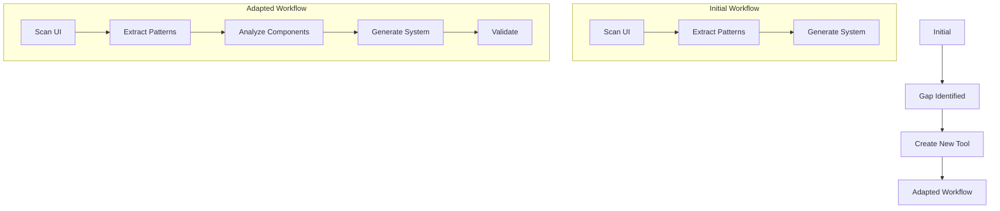

### Framework Integration

1. **Tool Building Triggers**
   - Workflow performance metrics
   - Missing capabilities
   - New requirements
   - Pattern recognition

2. **Memory System Integration**
   - Tools store results in appropriate memory levels
   - Workflow decisions influenced by memory context
   - Pattern recognition drives tool creation
   - Historical data guides optimization

3. **Continuous Improvement**
   - Regular workflow evaluation
   - Tool effectiveness assessment
   - Memory pattern analysis
   - Automated tool suggestions

This scenario demonstrates how ToolWeaver enables:
- Dynamic tool creation based on needs
- Workflow adaptation through memory systems
- Continuous improvement through pattern recognition
- Intelligent resource utilization

## Natural Language Interaction

ToolWeaver provides a user-friendly interface through natural language commands, making it accessible to both technical and non-technical users.

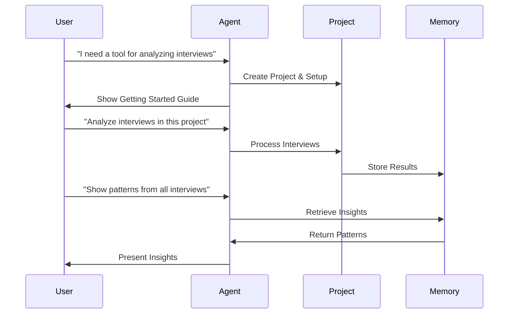

### User-Friendly Commands

Users can interact with the system using natural language:

1. **Project Management**
   ```
   "Open project UX Research Q1"
   "Continue working on Interview Analysis"
   "Rename project to Q2 Research"
   ```

2. **Analysis Commands**
   ```
   "Analyze the new interviews"
   "Show patterns from all interviews"
   "Export insights as PDF"
   ```

3. **Help and Guidance**
   ```
   "Help me with analyzing interviews"
   "What can this tool do?"
   "Show available commands"
   ```

### User-Type Adaptation

The system automatically adapts to different user types:

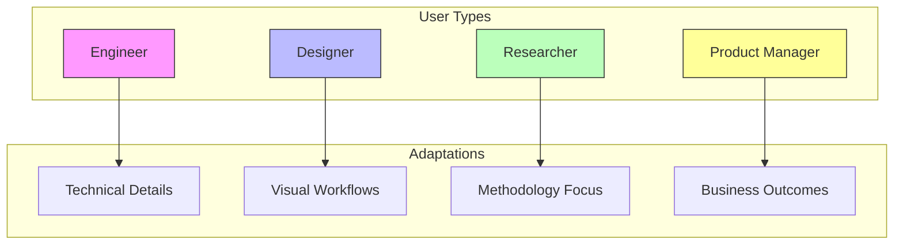

### Project Context Management

The system maintains context across sessions:

1. **Context Persistence**
   - Saves project state on switching
   - Restores context when returning
   - Maintains recent actions history

2. **User Context**
   - Automatically detects user type
   - Adapts interaction style
   - Provides relevant examples

3. **Workflow Guidance**
   - Shows next steps
   - Suggests relevant commands
   - Provides contextual help

## Real-World Usage: A Tale of Two Projects

Let's follow two UX researchers, Alice and Bob, as they use ToolWeaver for different projects. This example demonstrates how the system adapts to different needs and automatically creates tools when required.

### Project Initialization

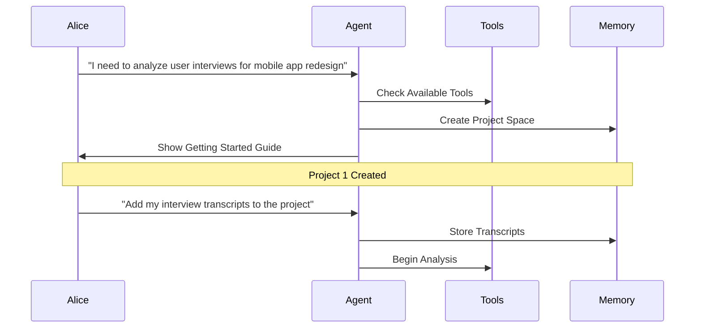

Alice starts her mobile app redesign project:

```
Alice: "I need to analyze user interviews for mobile app redesign"
Agent: "I'll create a new project for your mobile app research. I'll set up:
       - Interview analysis tools
       - Project workspace
       - Memory namespace
       Would you like to start with the interview analysis?"

Alice: "Yes, I have 20 interview transcripts to analyze"
Agent: "I'll set up batch processing for your interviews. 
       Please put the transcripts in the data/interviews folder.
       I'll analyze them automatically and generate insights."
```

Meanwhile, Bob starts his enterprise dashboard project:

```
Bob: "Create a project for enterprise dashboard user research"
Agent: "Creating project 'enterprise_dashboard_research'.
       I'll set up the same interview analysis toolkit.
       Where would you like to store your project files?"

Bob: "Use the default location"
Agent: "Project created. You can start by adding your interview transcripts."
```

### Diverging Project Needs

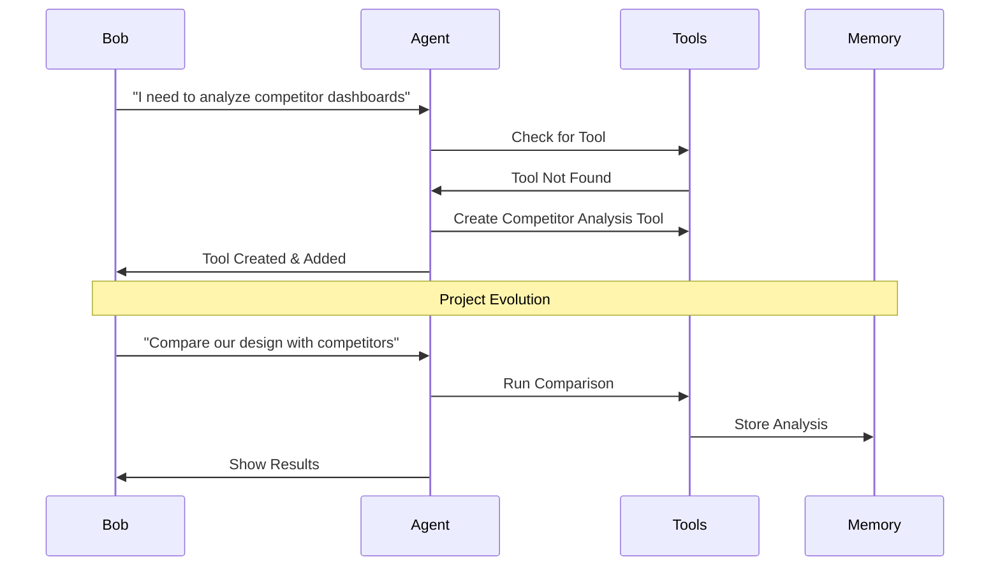

As the projects progress, different needs emerge:

```
Bob: "I need to analyze competitor dashboards too"
Agent: "I notice we don't have a competitor analysis tool yet.
       I'll create one that can:
       - Analyze dashboard screenshots
       - Compare feature sets
       - Track UX patterns
       Creating tool now..."

[Agent creates new tool]

Agent: "I've created and added the competitor_analysis tool to your project.
       You can now use commands like:
       - 'Analyze competitor dashboard <screenshot>'
       - 'Compare our features with competitors'
       - 'Show competitive analysis report'"
```

### Project Configurations Diverge

```yaml
# mobile_app/project.yaml
tools:
  - name: "interview_analyzer"
    config:
      focus: "mobile_interactions"
  - name: "insight_synthesizer"
    config:
      patterns: ["gesture_patterns", "mobile_flows"]

# enterprise_dashboard/project.yaml
tools:
  - name: "interview_analyzer"
    config:
      focus: "dashboard_usability"
  - name: "insight_synthesizer"
    config:
      patterns: ["data_visualization", "workflow_patterns"]
  - name: "competitor_analysis"    # Additional tool
    config:
      focus: "enterprise_dashboards"
      features: ["layout_analysis", "feature_comparison"]
```

### Cross-Project Learning

Later, Alice discovers Bob's competitor analysis approach:

```
Alice: "Show me what tools are available in other projects"
Agent: "I see a competitor_analysis tool in the enterprise_dashboard project.
       Would you like me to adapt it for mobile app analysis?"

Alice: "Yes, adapt it for mobile app competitors"
Agent: "I'll modify the tool for mobile app analysis:
       - Updating feature comparison for mobile apps
       - Adding gesture pattern analysis
       - Modifying layout analysis for mobile screens"
```

### Memory System Adaptation

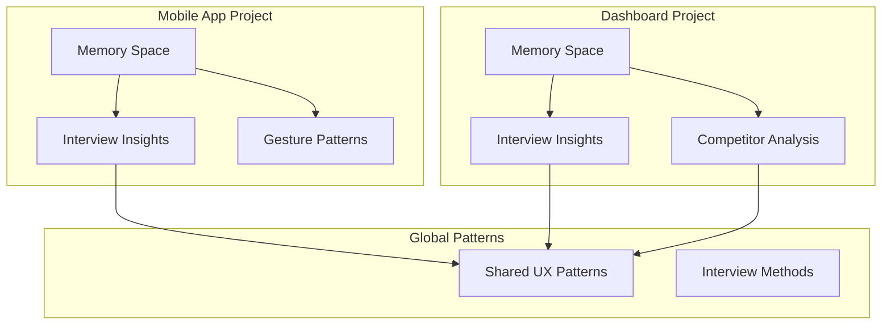

The memory system maintains project isolation while enabling pattern sharing:

```
Bob: "What patterns can we share with other projects?"
Agent: "I've identified these shareable patterns:
       - User interview techniques
       - Navigation preferences
       - Information hierarchy
       Would you like me to share these with the mobile app project?"
```

### Project Evolution

As projects evolve, they develop distinct tool sets:

Mobile App Project:
```python
# Original tools
- interview_analyzer (mobile focus)
- insight_synthesizer
- journey_mapper

# Added later
- competitor_analysis (mobile-adapted)
- gesture_pattern_analyzer
```

Dashboard Project:
```python
# Original tools
- interview_analyzer (dashboard focus)
- insight_synthesizer
- competitor_analysis (original)

# Added later
- dashboard_heuristic_evaluator
- data_visualization_analyzer
```

This real-world example demonstrates how:
1. Projects can start with similar tools but evolve differently
2. The agent creates new tools based on emerging needs
3. Tools can be shared and adapted between projects
4. Memory systems maintain project isolation while enabling pattern sharing
